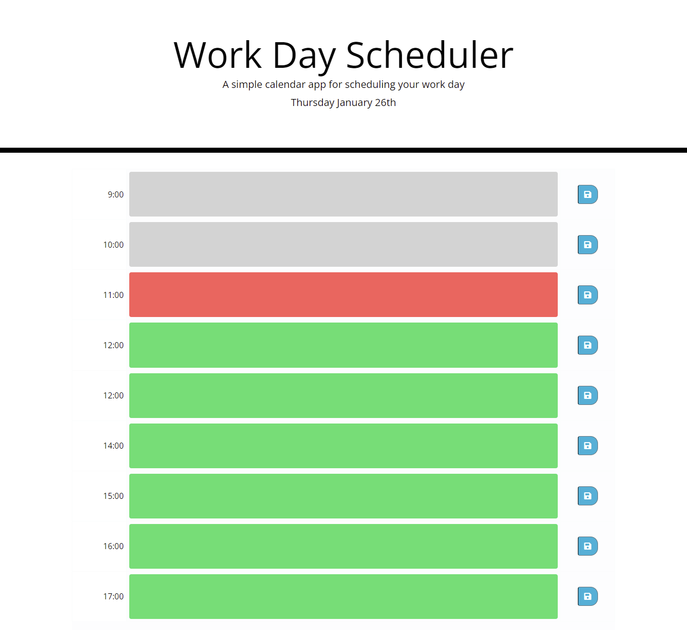

# work-day-scheduler

## Description

This application is designed to help working individuals with busy schedules who would benefit from a daily planner to manage their time effectively. Features include:
*The current date being displayed at the top of the calender
*Timeblocks for business hours (9am-5pm) where users can enter their tasks
*The timeblocks are colour-coded based on whether they are in the past, present, and future
*Users can save their tasks to a timeblock using a save button so they persist between refreshes of the page

## Screenshot

## Link to deployed website 

https://ffionerin.github.io/work-day-scheduler/
